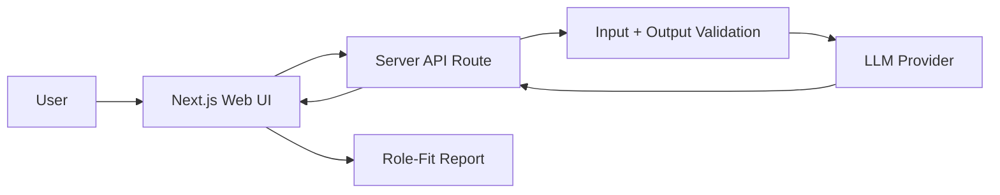

# Atlas Architecture Notes

## System Overview

Atlas follows a simple request-response architecture suitable for a Week 4 capstone MVP.

## Components

### Web UI

The UI collects resume content and a target job description, then renders the report. It should use a two-column desktop layout and a single-column mobile layout.

### API Route

The server API route validates inputs, constructs the analysis prompt, calls the AI provider, validates the response, and returns structured JSON to the UI.

### AI Module

The AI module is responsible for prompt construction and response parsing. It should be isolated from UI code so it can be tested independently.

### Validation Layer

Input and output schemas should prevent empty requests and malformed AI responses from breaking the UI.

## Data Flow

1. User submits resume and job description.
2. Client sends request to `/api/analyze`.
3. Server validates request.
4. Server builds prompt from validated fields.
5. Server calls the AI provider.
6. Server validates the returned structure.
7. Client renders the report.

## Privacy and Safety

Atlas should not store resumes or job descriptions in version 1. Logs should avoid printing raw resume content. The UI should explain that the app provides career guidance and not hiring guarantees.

## Deployment

The intended deployment target is Vercel. Environment variables should be configured in Vercel and never committed to GitHub.

