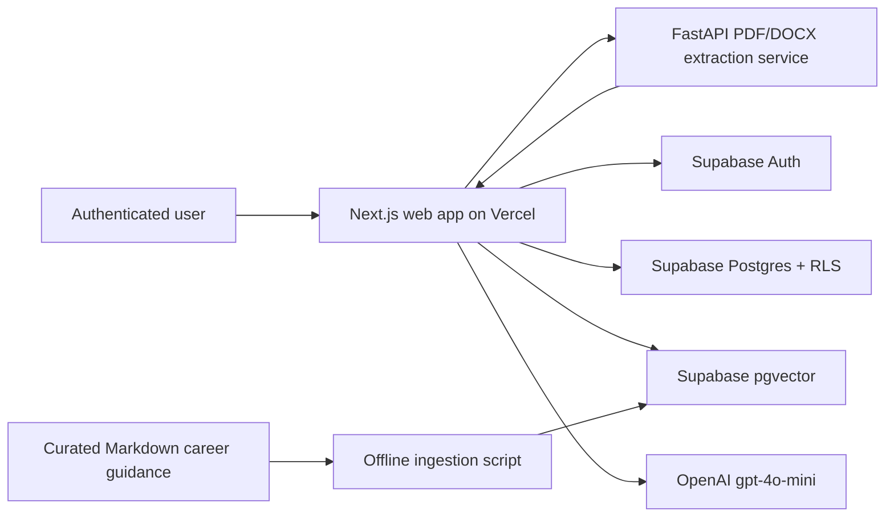

# Architecture Notes

## Purpose

Atlas is a modular monolith: one Next.js application owns the authenticated product workflow and calls a small Python service only for document extraction. This keeps the capstone deployable, testable, and easy to explain while preserving clear boundaries for AI, retrieval, and private user data.

## System Diagram

## Runtime Flow

1. Supabase Auth identifies the user before any analysis or saved-data operation.
2. The web app sends a PDF/DOCX to the FastAPI document service for temporary text extraction.
3. The user reviews and edits extracted text in the web app.
4. The server retrieves relevant curated guidance from `pgvector` and calls OpenAI with labeled resume, role, and guidance context.
5. The server validates structured output, assigns stable quest IDs and XP, then saves the report, structured resume evidence, and quest rows under the user ID.
6. The dashboard reads report and quest state. Ask Atlas uses the current report, structured evidence, progress, and retrieved guidance; it has no cross-report memory.

## Module Responsibilities

| Module | Responsibility |
| --- | --- |
| `apps/web/src/modules` | User-facing auth, analysis, report, quest, Ask Atlas, and public-site experiences. |
| `apps/web/src/core/ai` | Prompt construction, OpenAI client, structured output schemas, and report assembly. |
| `apps/web/src/core/rag` | Server-side retrieval of curated career guidance. |
| `apps/web/src/core/supabase` | Browser/server clients and authenticated data access. |
| `services/knowledge/document-service` | File validation and temporary PDF/DOCX extraction only; it never generates reports. |
| `services/knowledge/rag` | Offline/admin ingestion of curated Markdown resources only. |
| `supabase/migrations` | Database schema, `pgvector`, Row Level Security, and ownership policies. |

## Data and Permission Boundaries

- `auth.users` is the identity source. Every user-owned record has `user_id` and is protected by Supabase RLS.
- Atlas stores report JSON, structured resume evidence, job-description text, messages, and quest completion state. It does not store uploaded resume files or full raw resume text.
- Curated career-resource chunks are shared read-only knowledge. Private resumes, job descriptions, reports, and chat messages never enter the RAG corpus.
- OpenAI and Supabase service-role credentials remain server-side. Client code may only use the Supabase anonymous key.

## Failure Handling

- Reject unauthenticated, unsupported, empty, and oversized inputs before extraction or generation.
- Return a recoverable error if document extraction, retrieval, OpenAI, or persistence fails; do not save a partial report or award progress.
- Validate model output before rendering or saving it.
- Scope report, message, and quest updates to the authenticated owner. Cross-user access returns no data or an authorization error.

## Deployment and Quality

- Vercel hosts the Next.js app and server-side API routes.
- Render or Railway hosts the Python document service.
- Supabase hosts Auth, Postgres, and `pgvector`.
- GitHub Actions runs lint, TypeScript/web tests, production build, Python tests, and secret scanning on push and pull request.

The detailed schema lives in [Data Model](data-model.md); endpoint behavior lives in [Server Actions and API](server-actions-and-api.md); implementation acceptance criteria live in the root [spec](../../spec.md).
