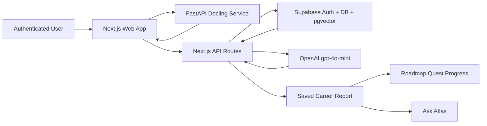

# System Overview

Atlas is an authenticated AI career-readiness web application. A user uploads a resume, reviews extracted text, supplies a target job description or supported career path, and receives a structured report with personalized roadmap quests grounded by a curated career-guidance knowledge base. See [Architecture Notes](architecture-notes.md) for the submission-ready architecture summary.

## Primary Flow

1. User signs in with Supabase Auth.
2. User uploads a PDF or DOCX resume.
3. The web app sends the file to the Python document service.
4. The document service uses Docling to extract text and returns it without storing the file.
5. User reviews and edits extracted resume text.
6. User pastes a target job description or selects a supported career path, which is synthesized into a representative role profile.
7. The web app retrieves relevant RAG chunks from Supabase `pgvector`.
8. The web app calls OpenAI `gpt-4o-mini` server-side.
9. The server validates the structured report.
10. The report is saved under the authenticated user.
11. Roadmap quests are initialized for the report.
12. User can mark roadmap quests complete or incomplete.
13. Ask Atlas becomes available for follow-up questions.

## Knowledge Boundary

Atlas uses two kinds of documents:

- User resumes: private, processed temporarily, not stored as full raw text, not embedded into the RAG database in v1.
- Career guidance resources: curated Markdown files that are embedded and stored in Supabase for RAG.

## Components

- `apps/web`: sign-in, resume upload, extracted-text review, target-role entry, report rendering, roadmap quest progress, saved reports, and Ask Atlas.
- `services/knowledge/document-service`: FastAPI service that uses Docling to extract text from PDF/DOCX resumes.
- `services/knowledge/rag`: offline ingestion and retrieval helpers for curated Markdown career guidance.
- `supabase`: auth, user-owned reports/messages, row-level security, and `pgvector` retrieval.
- OpenAI: `gpt-4o-mini` for generation and `text-embedding-3-small` for embeddings.

## Core Principle

Atlas does not try to become a full job-search platform or daily learning game in v1. It focuses on one useful workflow: compare one resume to one target role and map the next career move through trackable quests.

Atlas provides career guidance, not hiring guarantees.
